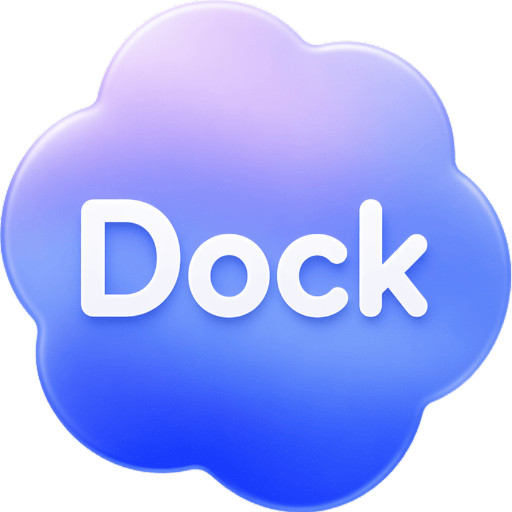
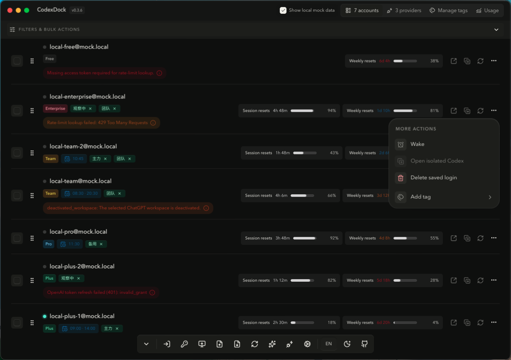

# CodexDock

[中文](./README.zh-CN.md)

<p align="center">
  
</p>

CodexDock is a desktop account manager for Codex sessions. It provides a tray-friendly Electron app for switching accounts, checking usage, and launching Codex, and it also ships a `cdock` CLI for scripting the same workflows.



## What It Does

- Import the current local Codex login into managed accounts
- Start browser or device-code login flows
- Switch to a specific account or automatically activate the best account
- Read session and weekly usage limits for saved accounts
- Launch the Codex desktop app with the selected account
- Manage app settings such as polling interval, language, theme, and menu bar accounts
- Provide the same core workflows through the `cdock` CLI

## App And CLI

The project has two entrypoints:

- Desktop app: Electron + Svelte UI for day-to-day account management
- CLI: `cdock` for automation, inspection, and account operations

Supported commands:

```bash
cdock account list                         # List all managed accounts
cdock account import-current               # Import the current local Codex login
cdock account import [--file <path>]        # Import accounts from a JSON file or stdin
cdock account export [account-id...]        # Export all accounts or selected account IDs
cdock account activate <account-id>         # Make an account the active Codex session
cdock account best                         # Activate the best available account automatically
cdock account remove <account-id>           # Remove a managed account
cdock instance list                        # List isolated Codex instances
cdock instance create --name <name>         # Create a new isolated Codex instance
cdock instance update <instance-id|default> # Update an instance configuration
cdock instance start <instance-id|default>  # Start an isolated Codex instance
cdock instance stop <instance-id|default>   # Stop a running isolated instance
cdock instance remove <instance-id>         # Delete an isolated instance
cdock provider list                        # List custom API providers
cdock provider create                      # Create a custom API provider interactively or with flags
cdock provider update <provider-id>         # Update a custom provider
cdock provider remove <provider-id>         # Remove a custom provider
cdock provider check <provider-id>          # Validate a provider configuration
cdock provider open <provider-id>           # Open Codex with a custom provider
cdock tag list                             # List account tags
cdock tag create <name>                     # Create a tag
cdock tag rename <tag-id> <name>            # Rename a tag
cdock tag remove <tag-id>                   # Delete a tag
cdock tag assign <account-id> <tag-id>      # Assign a tag to an account
cdock tag unassign <account-id> <tag-id>    # Remove a tag from an account
cdock session current                      # Show the current active Codex session
cdock usage read [account-id]               # Read session and weekly usage limits
cdock cost read [--refresh]                 # Read token cost statistics
cdock login browser                        # Start browser-based login
cdock login device                         # Start device-code login
cdock login port status                     # Inspect the local login callback port
cdock login port kill                       # Stop the process occupying the login callback port
cdock codex show                           # Show detected Codex desktop configuration
cdock codex open [account-id]               # Launch Codex with an account
cdock codex open-isolated <account-id>      # Launch Codex in an isolated environment
cdock doctor                               # Run environment diagnostics
cdock settings get [key]                    # Read one setting or all settings
cdock settings set <key> <value>            # Update a setting
```

Global CLI options:

- `--json`
- `--quiet`
- `--no-open`
- `--timeout <sec>`
- `--help`

Packaged app builds also ship `cdock` wrappers under `resources/bin/`. After an installed app starts once, it will try to install a user-level `cdock` shim into a writable `PATH` directory so `cdock ...` can be run directly from later shells.

## Homebrew Tap (macOS)

The macOS build can be distributed through a custom Homebrew tap:

```bash
brew tap bee1an/codexdock
brew install --cask codexdock
```

To upgrade later:

```bash
brew update
brew upgrade --cask codexdock
```

### If macOS blocks the app on first launch

Because the current build is not notarized by Apple, macOS Gatekeeper may show a warning such as “Apple cannot check the app for malicious software.”

Recommended ways to allow the app:

1. Click `Done` in the warning dialog.
2. Open `System Settings -> Privacy & Security`.
3. Scroll to the Security section and click `Open Anyway` / `Open`.

If you prefer the terminal and only want to allow this app, you can remove the quarantine attribute:

```bash
xattr -dr com.apple.quarantine "/Applications/CodexDock.app"
open "/Applications/CodexDock.app"
```

You can inspect whether the quarantine attribute is present first:

```bash
xattr -l "/Applications/CodexDock.app"
```

Avoid disabling Gatekeeper globally for this.

The release workflow can automatically update the cask in your own tap repository after each tag release. Setup details are documented in [docs/homebrew-tap.md](./docs/homebrew-tap.md).

## API Reference

- [Postman collection](./docs/postman-collection.json)
